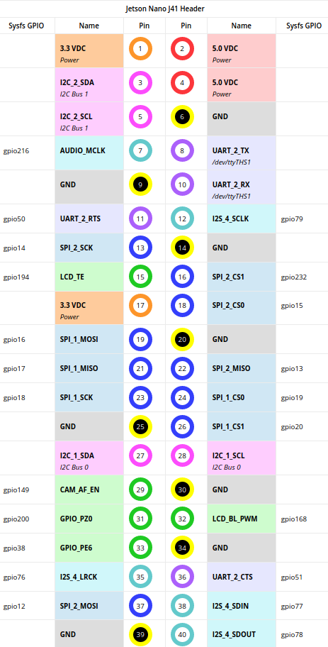

# jetbot_ros2_slam
## Project Description
Final Year Project (FYP) for Mechatronics and Robotic Systems programme at the University of Liverpool. 
Aim is to develop a codebase for a [Jetbot](https://github.com/NVIDIA-AI-IOT/jetbot) (hardware kit for an [Nvidia Jetson Nano](https://developer.nvidia.com/embedded/jetson-nano-developer-kit) ) to:
* Roam a room;
* Return to starting position;
* Collect data about the journey through odometry;
* Plot map from collected data.
Ideally C++ will be used for this approach, though Python will occasionally be implemented for easeness of use.

## Parts to be used
* [Jetbot Bill of Materials](https://github.com/NVIDIA-AI-IOT/jetbot/wiki/Bill-of-Materials)
* [Slotted Wheel Encoders](https://www.amazon.co.uk/Youmile-Measuring-Optocoupler-Interrupter-Detection/dp/B0817FM4BJ)
* [ToF Sensor, ST-VL15311X](https://www.st.com/en/imaging-and-photonics-solutions/vl53l1x.html)
* [IMU](https://coolcomponents.co.uk/products/grove-imu-9dof-icm20600-ak09918)

## Current Plan
Enable the Robot to create an Interrupt Request each time a change is detected by the wheel encoders. Recorded movement will be checked vs the intended movement and required adjustments will be made.

## GPIO Usage
C++ port of the Python GPIO Library from https://github.com/pjueon/JetsonGPIO
**NOTE:** When using this library, always state pin numbers as Strings, the version of the input function that takes integers is bugged.

## I2C Usage
Currently on hold. Library to be investigated.

## ROS2 Usage
Currently on hold, plan is to repurpose code from https://github.com/rosterloh/jetbot_ros2

Author: Vittorio Francescon
